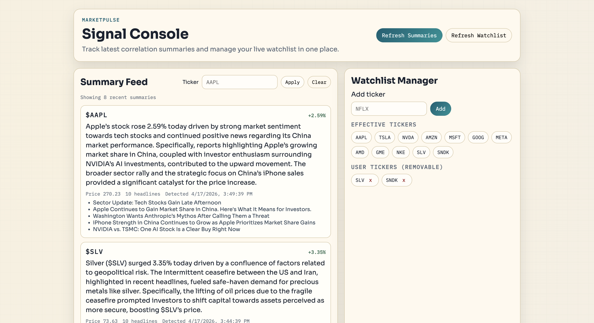

# MarketPulse

MarketPulse is a real-time news and stock correlation engine.

It ingests live stock prices and financial headlines, detects high-signal moves, generates concise AI explanations, and serves results through an API and dashboard.


## What it does

- Streams stock ticks and financial headlines into Kafka.
- Detects correlation events in rolling windows (news activity + significant price move).
- Uses Ollama to generate short causal summaries and embeddings.
- Stores enriched reports in PostgreSQL with pgvector.
- Provides a dashboard to view summaries and manage tickers.

## Runtime architecture

1. news producer -> topic `news-headlines`
2. stock producer -> topic `stock-ticks`
3. correlation detector consumes both topics -> topic `correlation-events`
4. research agent consumes `correlation-events` and writes reports to PostgreSQL
5. FastAPI serves dashboard + APIs

## Stack

- Python, FastAPI, SQLAlchemy
- Kafka (`confluent-kafka`)
- PostgreSQL + pgvector
- Ollama (`gemma3:4b`, `nomic-embed-text`)
- Docker Compose for infrastructure

## Quick start

1) Create environment and install dependencies

```bash
cp .env.example .env
make api-install
```

2) Start infrastructure (Kafka + PostgreSQL)

```bash
make up
```

3) Start Ollama and pull models

```bash
ollama serve
make ollama-pull
make test-ollama
```

4) Initialize database

```bash
make db-init
```

5) Run services (use separate terminals)

```bash
make news-producer
make stock-producer
make correlation-detector
make research-agent
make api-run
```

6) Open UI

To view the dashboard, start the API first:

```bash
make api-run
```

Then open:

- Dashboard: `http://localhost:8000/ui`
- Health: `http://localhost:8000/health`

## UI Preview



## API endpoints

### Reports

- `GET /reports?limit=40&ticker=AAPL&latest_only=true`
- By default, returns latest unique report per active ticker.

### Watchlist

- `GET /watchlist`
- `POST /watchlist` with JSON body: `{ "ticker": "NFLX" }`
- `DELETE /watchlist/{ticker}`

Examples:

```bash
curl http://localhost:8000/watchlist
curl -X POST http://localhost:8000/watchlist -H "Content-Type: application/json" -d '{"ticker":"NFLX"}'
curl -X DELETE http://localhost:8000/watchlist/NFLX
```

## Configuration highlights

See `.env.example` for all settings.

Commonly changed values:

- `KAFKA_BOOTSTRAP_SERVERS`
- `POSTGRES_HOST`, `POSTGRES_PORT`, `POSTGRES_DB`, `POSTGRES_USER`, `POSTGRES_PASSWORD`
- `OLLAMA_BASE_URL`, `OLLAMA_CHAT_MODEL`, `OLLAMA_EMBED_MODEL`
- `EXTRA_WATCHED_TICKERS`
- `WATCHLIST_FILE`

## Make targets

- `make up`, `make down`, `make logs`
- `make api-install`, `make api-run`
- `make news-producer`, `make stock-producer`
- `make correlation-detector`, `make research-agent`
- `make db-init`
- `make ollama-pull`, `make test-ollama`

## Troubleshooting

### Research agent: `[Errno 61] Connection refused`

Likely cause: Ollama not reachable.

Check:

```bash
curl -sS -m 3 http://127.0.0.1:11434/api/tags
```

Fix:

- Start `ollama serve`
- Run `make ollama-pull`

### Removed ticker still appears in feed

- Reports endpoint is filtered to active watchlist by default.
- Refresh dashboard and ensure API is running latest code.

## Status

MarketPulse is a strong real-time prototype with production-like service boundaries.
Next hardening steps: retries/DLQ, observability, auth, and CI/CD.
